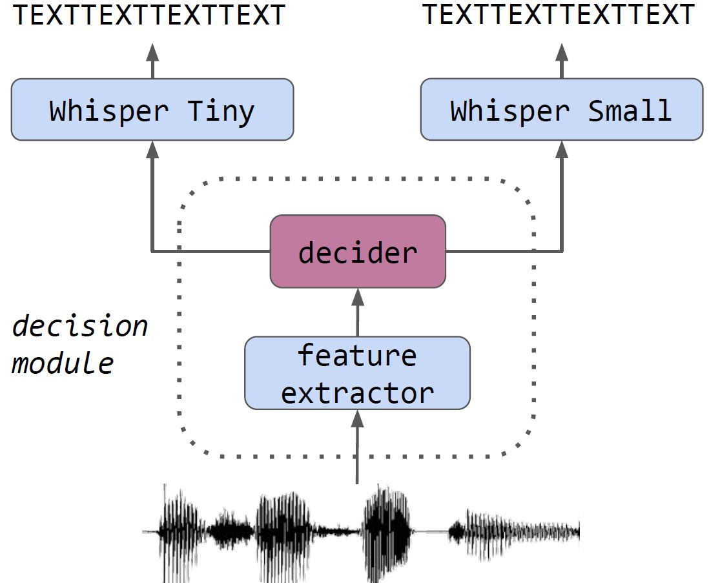

# Big model only for hard audios: Sample dependent Whisper model selection for efficient inferences (2023)

Here's the repository of [*Big model only for hard audios*](https://arxiv.org/abs/2309.12712). 
It contains all the files to reproduce our decider training and evaluate it, as well as our best model. 

Given an audio, our method first runs the encoder of Whisper small to extract representations. Then the decider module is applied to choose wheter to continue the inference with Whisper Small or to restart using Whisper Tiny if the audio is simple enough.

<p align="center">
	
</p>


### Installation

```
git clone https://github.com/hugomalard/Big-model-only-for-hard-audios.git 
cd Big-model-only-for-hard-audios

# creating a conda environment
conda create -n BMOHA python=3.8
conda activate BMOHA

pip install -r requirements.txt
```

### Extract WERs of Whisper Small and Whisper Tiny 
First change the different paths needed (for Whispers models and CommonVoice datasets), then run:
```
inferences_whisper.sh
```

### Train the decider module
You might want to change the hyperparameters of the model: edit the file 'BMOHA/hparams/cnn/train_cnn_ponderate.yaml'
```
python BMOHA/train_cnn_latent_space.py BMOHA/hparams/cnn/train_cnn_ponderate.yaml
```

### Inference using the decider module
The following code allow to perform an inference on a given dataset, while measuring the computational cost of the model (in MACs) and the performance (in WER).
```
python BMOHA/inference_decider_whisper.py BMOHA/hparams/cnn/inference_whisper_decider.yaml
```

### Citation
If you like our work please considere leaving a star, and citing us:
```bibtex
@misc{malard2023big,
      title={Big model only for hard audios: Sample dependent Whisper model selection for efficient inferences}, 
      author={Hugo Malard and Salah Zaiem and Robin Algayres},
      year={2023},
      eprint={2309.12712},
      archivePrefix={arXiv},
      primaryClass={eess.AS}
}


```
